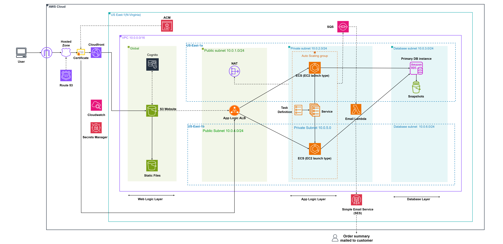
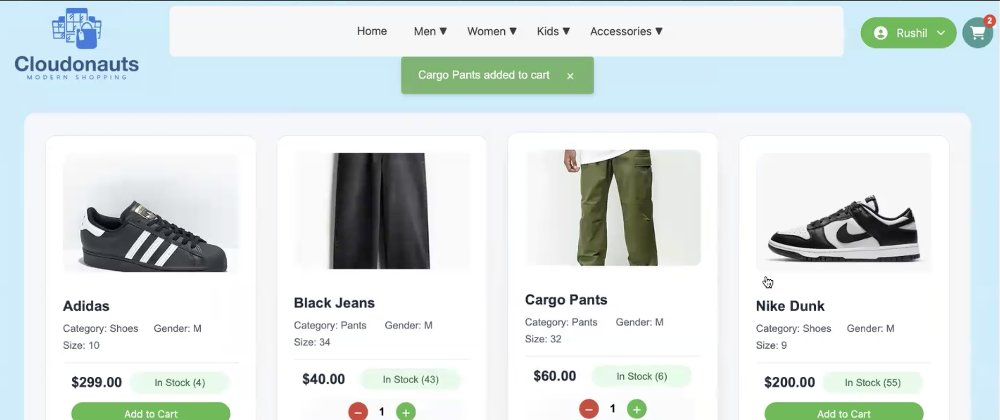

# AWS-Multi-tier-app


Designed and deployed a multi tier e-commerce website on AWS, the architecture of this website seperates the frontend, app logic and DB. 
Moreover it uses ECS for the app logic layer. It is also aligned with AWS's Well-Architectured Framework for cost-efficiency, reliability, and operational excellence.

---

<p align="center">
  
</p>
<p align="center"><i>Figure 1: Architecture</i></p>


Designed and deployed a scalable, secure multi-tier e-commerce web application using AWS cloud services, following industry-standard security and architectural best practices.

- Frontend developed using React, hosted on Amazon S3 with CloudFront for global content delivery and low-latency user experience.

- Backend built with Python APIs deployed via Amazon ECS, managed behind an Application Load Balancer (ALB) for dynamic traffic routing.

- Integrated Amazon RDS (PostgreSQL) to manage transactional data such as user accounts, orders, and product inventory.

- Utilized Amazon S3 for image storage and configured IAM roles and policies to ensure secure access control.

- Managed domain routing using Route 53, and enabled SSL/TLS encryption with AWS Certificate Manager (ACM) for secure HTTPS communication.

- Amazon CloudWatch for dynamic resource scaling and real-time monitoring.

### Obtaining the docker image for the ECS cluster Deployment
```bash
rushillabs/cloudonauts:v3.8
```

<p align="center">
  
</p>
<p align="center"><i>Figure 2: Project Frontend</i></p>

Skills: AWS Architecture · Amazon ECS · Amazon Relational Database Service (RDS) · AWS Identity and Access Management (AWS IAM) · AWS Application Load Balancer · AWS Auto Scaling · AWS VPC · AWS Security Group
